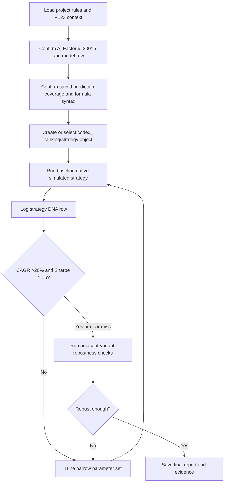

# Portfolio123 AI Factor Simulated Strategy Execution Plan

## Summary

Build and validate a native Portfolio123 simulated stock strategy using the top previously identified AI Factor model, `AI Factor Base 87 Features Andreas 2` / `extra trees medium 4 #2`. The plan uses browser-native P123 simulation as the final authority, limits tuning to high-impact settings, records every serious candidate in a strategy DNA log, and requires adjacent-variant checks before accepting any strategy that appears to clear `>20% CAGR` and `>1.5 Sharpe`.

---

## Problem Frame

The user wants an AI-assisted Portfolio123 strategy but needs a clean line between durable native validation and fragile historical curve fitting. The task is account-stateful, platform-specific, and sensitive to P123 AI Factor prediction windows, so execution must confirm formula integration and simulation coverage before any result can be trusted.

---

## Requirements

- R1. Use `AI Factor Base 87 Features Andreas 2` / `extra trees medium 4 #2` as the anchor model unless account verification shows it is unavailable.
- R2. Final success requires native Portfolio123 simulated strategy output with `CAGR >20%` and `Sharpe >1.5`.
- R3. Use the longest defensible simulation window, bounded by AI Factor prediction availability, model validity, and data-integrity constraints.
- R4. Resolve `AIFactor()` versus `AIFactorValidation()` inside the strategy/ranking context before performance results are considered valid.
- R5. Every P123 account object created by the agent must use the `codex_` prefix.
- R6. Use realistic liquidity, slippage, and position-concentration assumptions for the target universe.
- R7. Tune only high-impact knobs: universe/liquidity filters, position count, rebalance frequency, AI/rank threshold, rank tolerance, and simple sell/risk rules.
- R8. Reject or clearly label brittle winners by testing adjacent variants around any promising candidate.
- R9. Save candidate logs, native performance evidence, and final summary under `p123-output/`.
- R10. Never print or store plaintext secrets; use the encrypted local credential loader only when API access is needed.

---

## Scope Boundaries

- No live trading, live rebalancing, brokerage actions, or order placement.
- No deletion or overwriting of user-created P123 strategies, rankings, universes, or AI Factors.
- No final performance claims from local Python or API `screen_backtest` estimates.
- No broad brute-force optimization across unrelated strategy families without a later explicit approval.
- No plaintext credentials, API keys, browser cookies, or session values in project artifacts.
- No use of `agent_` for newly created P123 objects in this workspace; `codex_` is the active project rule.

---

## Context & Research

### Relevant Files and Artifacts

- `project-spec.md` defines the accepted strategy objective, risk responses, and deliverables.
- `project-constitution.md` defines hard boundaries around secrets, live trading, naming, and native validation.
- `AGENTS.md` requires the Portfolio123 skill for P123 work, project-local encrypted credential loading, `codex_` object names, and `p123-output/` artifacts.
- `p123-output/ai_factor_models_top_20260516.csv` identifies the top model as AI Factor id `20015`, model `extra trees medium 4 #2`, P123 Rank `100`, universe `No OTC Exchange + min 10 mil No Finance2`, with `17` results and `4` predictors.
- `docs/solutions/workflow-issues/portfolio123-browser-navigation-ai-factors-2026-05-16.md` records verified P123 routes and model ranking rules.

### Institutional Learnings

- Use `https://www.portfolio123.com/sv/opener/AIFACTOR/-2` for the AI Factor list and `https://www.portfolio123.com/sv/aiFactor/{id}/validation/models` for model rows.
- Use `https://www.portfolio123.com/app/opener/SIM` for native simulated strategy discovery.
- P123 account listings are often browser-first because broad API listing endpoints are missing.
- `AIFactorValidation("Exact AI Factor Name", "Exact Model Display Name")` is the right formula family for deeper historical backtests when saved validation predictions exist.
- `AIFactor()` uses live predictors and is typically limited for long historical tests; it is not interchangeable with validation predictions.
- P123 strategy wizard changes are only reliable after the proper save/run flow; tab reloads alone do not persist edits.

### External References

- Portfolio123 skill references used locally: `browser-workflows.md`, `ai-factor-guide.md`, and `strategy-templates.md`.

---

## Key Technical Decisions

- **Native simulation is the acceptance gate:** Use P123 simulated strategy output for final metrics because screen backtests are buy-side-only and local backtests are not authoritative for this platform.
- **Start with pure or near-pure AI ranking:** Begin with the selected AI Factor as the primary ranking signal, optionally using a small classic-quality kicker only if the first native candidate shows junk-stock exposure or unstable turnover.
- **Prefer `AIFactorValidation()` for long windows:** The target asks to go back as far as makes sense, and the AI Factor guide indicates validation predictions are the route for deeper backtests when saved predictions are available.
- **Use the prediction window as a hard bound:** If P123 returns "No predictions are available" errors, use the saved prediction coverage from that error or UI and shorten the simulation window rather than forcing MAX.
- **Small search surface:** Tune only adjacent settings around the baseline to reduce overfitting pressure and keep the result interpretable.
- **DNA log is the audit spine:** Every serious candidate gets one row with enough detail to reconstruct why it was kept or rejected.

---

## Open Questions

### Resolved During Planning

- **Which AI Factor is primary?** Use `AI Factor Base 87 Features Andreas 2` / `extra trees medium 4 #2`.
- **What naming convention applies?** Use `codex_` for every created P123 account object.
- **Can final success be declared from API exploration?** No. API/screen outputs are exploratory only and must be labeled `ESTIMATED (Tier 3)`.

### Deferred to Implementation

- **Exact prediction coverage dates:** Confirm inside P123 from the model/result pages or from formula errors during integration.
- **Exact formula surface:** Confirm whether the strategy should reference a ranking system containing `AIFactorValidation()` or use the AI Factor formula directly in rules, depending on P123 wizard capabilities.
- **Exact candidate settings that pass thresholds:** Discover through native P123 simulation, not plan-time speculation.

---

## High-Level Technical Design

> *This illustrates the intended approach and is directional guidance for review, not implementation specification. The implementing agent should treat it as context, not code to reproduce.*

---

## Implementation Units

### U1. Preflight Context and Safe Access

**Goal:** Establish the execution context without leaking secrets or touching live portfolios.

**Requirements:** R1, R5, R9, R10

**Dependencies:** None

**Files:**
- Read: `AGENTS.md`
- Read: `project-spec.md`
- Read: `project-constitution.md`
- Read: `p123-output/ai_factor_models_top_20260516.csv`
- Read: `docs/solutions/workflow-issues/portfolio123-browser-navigation-ai-factors-2026-05-16.md`
- Read: `scripts/Import-Portfolio123Secrets.ps1`
- Create/modify: `p123-output/strategy_dna_log_YYYYMMDD.csv`

**Approach:**
- Load the Portfolio123 skill before P123 work.
- Prefer the logged-in Chrome session for account-state pages.
- Load encrypted credentials only if an API-supported step genuinely needs them.
- Initialize the DNA log schema before candidate testing starts.

**Patterns to follow:**
- `AGENTS.md` authentication and output conventions.
- `project-constitution.md` hard boundaries.

**Test scenarios:**
- Happy path: Existing AI factor CSV is readable and the top row resolves to id `20015`.
- Error path: Credential loader is missing or fails; continue browser-only where possible and report the API limitation without printing values.
- Integration: A created DNA log row can hold the full baseline candidate configuration and result fields.

**Verification:**
- The agent can state the top model, target universe, model URL, and local artifact paths without exposing secrets.

---

### U2. Confirm AI Factor Availability and Prediction Surface

**Goal:** Verify the selected AI Factor/model is still present and has usable validation/predictor outputs.

**Requirements:** R1, R3, R4

**Dependencies:** U1

**Files:**
- Create: `p123-output/ai_factor_20015_verification_YYYYMMDD.json`
- Optional create: `p123-output/ai_factor_20015_verification_YYYYMMDD.png`

**Approach:**
- Open the verified P123 route `sv/aiFactor/20015/validation/models`.
- Confirm the model display name exactly matches `extra trees medium 4 #2`.
- Inspect Results and Predictors tabs as needed to determine whether saved validation predictions and live predictors are available.
- Capture exact names case-sensitively for formula use.

**Patterns to follow:**
- AI Factor navigation from `docs/solutions/workflow-issues/portfolio123-browser-navigation-ai-factors-2026-05-16.md`.
- AI Factor formula guidance from `ai-factor-guide.md`.

**Test scenarios:**
- Happy path: Model row is present with P123 Rank `100`, Results populated, and Predictors populated.
- Edge case: Model exists but no saved validation predictions are available; switch plan posture to shorter `AIFactor()`-bounded validation or ask before retraining.
- Error path: AI Factor id route loads but model name differs; re-read the list route and update candidate metadata before proceeding.

**Verification:**
- A verification artifact records exact AI Factor name, model display name, route, results count, predictors count, and known prediction-window constraints.

---

### U3. Validate Formula Integration in a Ranking/Strategy Context

**Goal:** Prove the selected AI Factor can be referenced in the surface that will drive the simulated strategy.

**Requirements:** R3, R4, R6

**Dependencies:** U2

**Files:**
- Create: `p123-output/ai_factor_formula_validation_YYYYMMDD.md`
- Optional create/modify: `p123-output/strategy_dna_log_YYYYMMDD.csv`

**Approach:**
- Prefer a ranking system that contains the exact AI Factor validation formula when long historical coverage is needed.
- Use exact case-sensitive strings copied from P123 UI.
- If P123 reports unavailable predictions for a requested date, capture the reported saved prediction coverage and set the strategy period within that range.
- Do not advance to performance tuning until formula validation succeeds in the native context.

**Patterns to follow:**
- `AIFactorValidation("Exact AI Factor Name", "Exact Model Display Name")` for saved validation predictions.
- P123 formula names and quotes must be copied exactly from the UI.

**Test scenarios:**
- Happy path: `AIFactorValidation()` evaluates over the target prediction window without formula errors.
- Edge case: `AIFactorValidation()` works only after shortening the period; document the new start/end dates and reason.
- Error path: Formula errors due to name mismatch; correct names from UI rather than guessing.
- Integration: The formula-bearing ranking or strategy can be selected by the P123 simulated strategy wizard.

**Verification:**
- The final formula choice and usable date range are captured before any candidate is considered valid.

---

### U4. Build the Baseline Native Simulated Strategy

**Goal:** Create the simplest defensible `codex_` native simulated strategy using the verified AI Factor integration.

**Requirements:** R2, R3, R5, R6, R9

**Dependencies:** U3

**Files:**
- Create/modify: `p123-output/strategy_dna_log_YYYYMMDD.csv`
- Optional create: `p123-output/codex_strategy_ai_factor_baseline_YYYYMMDD.md`
- Optional create: `p123-output/codex_strategy_ai_factor_baseline_YYYYMMDD.png`

**Approach:**
- Use a descriptive P123 name such as `codex_strategy_ai_factor_base87_et_v1`.
- Use the target universe from the AI Factor metadata as the initial universe where feasible: `No OTC Exchange + min 10 mil No Finance2`.
- Start with 15-25 positions, realistic slippage, and weekly or every-4-weeks rebalance.
- Buy the top-ranked AI Factor names with basic liquidity/price constraints.
- Sell on rank deterioration or position rank falling outside the intended holding band, keeping risk rules simple.

**Patterns to follow:**
- Strategy wizard tab ownership from `browser-workflows.md`.
- Strategy layer separation from `strategy-templates.md`: hard filters in universe, relative attractiveness in ranking, execution rules in strategy.

**Test scenarios:**
- Happy path: Strategy saves and redirects to a summary page with sane metrics.
- Edge case: P123 resets the period to a short default; reset the period to the prediction-valid range and re-run.
- Error path: Summary shows sentinel values such as impossible negative position counts; re-trigger the native simulation instead of reading metrics.
- Integration: P123 object name begins with `codex_` and does not overwrite an existing user object.

**Verification:**
- Baseline strategy has a P123 summary page, native metrics, a screenshot or extracted evidence, and one completed DNA log row.

---

### U5. Narrow Candidate Search

**Goal:** Explore high-impact settings while keeping the search small enough to avoid obvious overfitting.

**Requirements:** R2, R6, R7, R9

**Dependencies:** U4

**Files:**
- Modify: `p123-output/strategy_dna_log_YYYYMMDD.csv`
- Create: `p123-output/candidate_search_summary_YYYYMMDD.md`

**Approach:**
- Vary one or two settings at a time around the baseline.
- Candidate dimensions: position count `15/20/25`, rebalance weekly versus every 4 weeks, buy rank threshold, sell rank/RankPos threshold, rank tolerance, and liquidity minimum.
- Keep batch size modest; if the search expands beyond roughly 20 candidate sims, pause and ask for approval.
- Prefer settings that improve both CAGR and Sharpe without causing extreme drawdown, turnover, or date-window fragility.

**Patterns to follow:**
- Parameter sweep dimensions from `strategy-templates.md`.
- P123 validation hierarchy from `AGENTS.md` and the Portfolio123 skill.

**Test scenarios:**
- Happy path: Candidate runs complete and each row has complete DNA fields.
- Edge case: A high-CAGR candidate fails Sharpe due to volatility; keep it as rejected with rationale rather than hiding it.
- Edge case: A high-Sharpe candidate misses CAGR; preserve it as a possible conservative branch.
- Error path: Formula/date errors recur after a settings change; route back to U3 to revalidate the prediction window.

**Verification:**
- The candidate summary identifies the best candidates by native CAGR, Sharpe, drawdown, and robustness-readiness.

---

### U6. Robustness Checks on Promising Candidates

**Goal:** Decide whether a candidate that clears or nearly clears the target is real enough to recommend.

**Requirements:** R2, R3, R8, R9

**Dependencies:** U5

**Files:**
- Modify: `p123-output/strategy_dna_log_YYYYMMDD.csv`
- Create: `p123-output/robustness_checks_YYYYMMDD.md`

**Approach:**
- For each promising candidate, run adjacent variants around the winning settings.
- Examples: plus/minus 5 positions, adjacent buy/sell rank thresholds, weekly versus every-4-weeks rebalance, slightly stricter liquidity, and alternate start date inside the prediction window if available.
- Accept a lower headline return if it is materially more stable across adjacent variants.
- Label a candidate fragile if only one exact parameter combination clears the target.

**Patterns to follow:**
- Project spec requirement to address overfitting pressure.
- Strategy DNA log schema from `project-spec.md`.

**Test scenarios:**
- Happy path: Winner clears both metrics and adjacent variants remain directionally strong.
- Edge case: Winner clears metrics but adjacent variants collapse; reject or label fragile.
- Edge case: No candidate clears both metrics but several are close; rank by best native evidence and explain blockers.
- Integration: Robustness evidence links back to candidate IDs in the DNA log.

**Verification:**
- A robustness report states whether the leading strategy is accepted, fragile, or rejected, with exact supporting candidate IDs.

---

### U7. Final Report and Handoff

**Goal:** Deliver a concise, evidence-backed outcome the user can trust and resume later.

**Requirements:** R2, R8, R9, R10

**Dependencies:** U6

**Files:**
- Create: `p123-output/final_ai_factor_strategy_report_YYYYMMDD.md`
- Modify: `p123-output/strategy_dna_log_YYYYMMDD.csv`
- Optional create: `docs/solutions/workflow-issues/<future-learning>.md` only if the user approves `ce-compound`

**Approach:**
- Summarize the final accepted strategy or closest failed candidates.
- Clearly state validation tier, simulation period, CAGR, Sharpe, max drawdown, turnover if available, and P123 object names/IDs.
- Include why the start date is the longest defensible date.
- Recommend `ce-compound` if new reusable P123 navigation, formula, or platform quirks were discovered.

**Patterns to follow:**
- Output conventions in `AGENTS.md`.
- Learning capture guidance in the compound-engineering section of `AGENTS.md`.

**Test scenarios:**
- Happy path: Final report names a native-validated candidate that clears both targets.
- Edge case: No candidate clears both targets; final report identifies closest candidates and exact blockers.
- Error path: Browser/API limitations prevent final validation; report what was completed and what manual step is needed.

**Verification:**
- The user receives a final answer that distinguishes native results from estimates and links to local artifacts.

---

## System-Wide Impact

- **Interaction graph:** P123 Chrome session, P123 account objects, optional P123 API credentials, local `p123-output/` artifacts, and workspace instruction files all interact.
- **Error propagation:** Formula/date errors must block strategy acceptance and route back to AI Factor integration rather than being treated as poor performance.
- **State lifecycle risks:** Saved P123 objects persist in the user's account; use `codex_` names and avoid deleting or overwriting existing objects.
- **API surface parity:** Browser discovery is authoritative for account listing; API may support known-ID data pulls but should not be assumed to list all objects.
- **Integration coverage:** The key cross-surface proof is formula integration inside native simulation, not just AI Factor model-table rank.
- **Unchanged invariants:** No live trading, no plaintext secrets, and no non-native final performance claims.

---

## Risks & Dependencies

| Risk | Mitigation |
|------|------------|
| AI Factor lacks saved validation predictions over a long enough window | Confirm prediction coverage early; use the longest valid window or ask before retraining/changing validation method |
| P123 formula string differs from expected syntax | Copy exact names from UI; test formula integration before performance tuning |
| UI automation fails or P123 stale-element behavior blocks progress | Follow browser-workflows snapshot-verify and graceful degradation; provide manual instructions after repeated failures |
| Target metrics are not achievable under realistic costs | Report closest native-validated candidates and blockers instead of over-tuning |
| Parameter search overfits history | Keep search narrow, require adjacent-variant checks, and prefer robust lower-headline candidates |
| Created account objects confuse user-owned work | Enforce `codex_` prefix on every created object |
| Secrets leak into logs/artifacts | Use environment variables and encrypted loader only; never print values |

---

## Success Metrics

- The selected AI Factor/model is verified in the user's account with exact names and route.
- The strategy/ranking formula is validated in P123 over a documented usable prediction window.
- At least one native simulated strategy candidate is created with a `codex_` name and recorded in the DNA log.
- Final result either clears `>20% CAGR` and `>1.5 Sharpe` in native P123 output, or the report explains why the thresholds were not reached.
- Any accepted winner has adjacent-variant evidence showing it is not a single brittle parameter accident.

---

## Documentation / Operational Notes

- Keep all local outputs in `p123-output/`.
- Use `docs/solutions/` only for durable learning after the user approves or explicitly invokes `ce-compound`.
- Preserve screenshots or JSON/Markdown evidence for native P123 metrics because some P123 result tables are not reliably visible in browser snapshots.
- If the strategy search reveals a reusable formula/window/navigation issue, recommend `ce-compound` before ending the work.

---

## Sources & References

- **Origin document:** `project-spec.md`
- **Constitution:** `project-constitution.md`
- **Workspace rules:** `AGENTS.md`
- **Top AI Factor output:** `p123-output/ai_factor_models_top_20260516.csv`
- **Navigation learning:** `docs/solutions/workflow-issues/portfolio123-browser-navigation-ai-factors-2026-05-16.md`
- **Portfolio123 skill:** global Codex skill `portfolio123`

---

## Tags

#algo-trading/portfolio123 #work/plans
