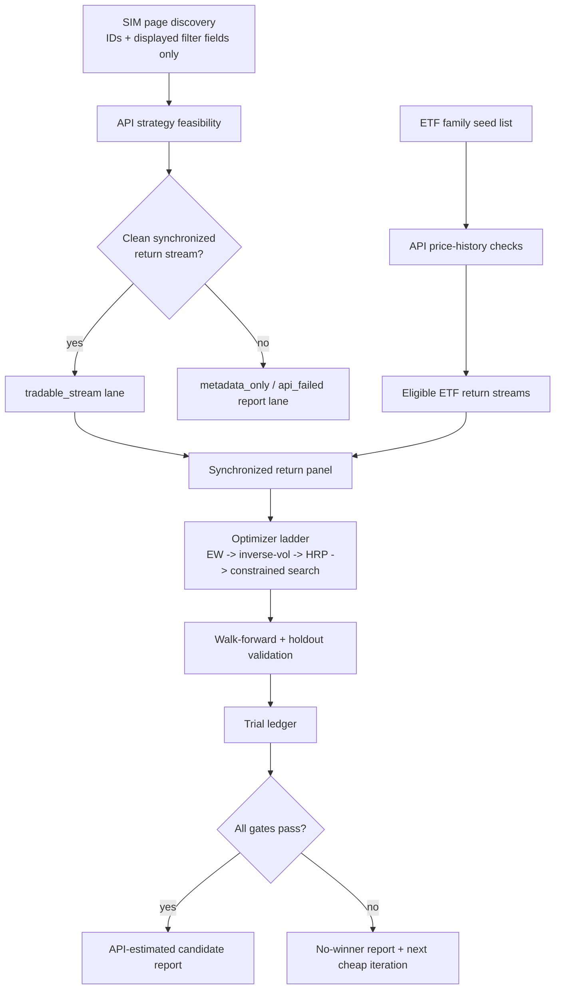

# API-Only Portfolio123 Strategy Book Candidate Plan

## Summary

Build an API-only research workflow that discovers eligible Portfolio123 simulated strategy IDs from the SIM page, switches to API-derived data for all performance work, constructs a broad pre-2007 ETF universe, and evaluates Strategy Book candidates through a pre-registered optimizer ladder. The plan incorporates all sensible ideation survivors: two-lane candidates, ETF-family funnel, inverse-sleeve diagnostics, credit stoplights, a primary trial ledger, and a first-class no-winner report.

---

## Problem Frame

The user wants to find whether existing high-Sharpe, pre-2007 Portfolio123 simulated strategies can combine with ETFs into a statistically valid Strategy Book candidate clearing CAGR >20% and Sharpe >1.6 back to the common inception window. The hard challenge is that the P123 API requires known IDs and may not expose clean strategy return streams, while broad ETF and allocation searches can easily overfit. This plan maximizes useful discovery while preserving API-only performance claims, P123 credit discipline, and honest statistical validation.

---

## Requirements

- R1. Use the current SIM page only for candidate strategy ID and displayed-metadata discovery; all performance, return, ETF, and allocation work must be API-derived.
- R2. Filter simulated strategies to displayed Sharpe ratio >1 and inception date before 2007, then validate API feasibility.
- R3. Split strategies into `tradable_stream`, `metadata_only`, and `api_failed` lanes before optimization.
- R4. Build a broad ETF candidate funnel by economic family, including inverse ETFs with inception before 2007 and excluding leveraged ETFs unless later approved.
- R5. Enforce allocation constraints: long-only portfolio weights, inverse ETFs allowed as long positions, max 25% per component, max 35% total inverse sleeve.
- R6. Run a pre-registered optimizer ladder: equal-weight baseline, inverse-volatility, HRP, then small constrained ensemble search.
- R7. Count every tested allocation in `n_trials`; compute CAGR, Sharpe, max drawdown, PSR, DSR, and gate status.
- R8. Stop and ask before proceeding if estimated Portfolio123 API usage exceeds 250 credits.
- R9. Save CSV/JSON artifacts under `p123-output/`, with the trial ledger as the primary research artifact.
- R10. Keep `iteration.md` updated with decisions, credit estimates/actuals, rejected alternatives, results, caveats, and Tier 1 validation requirements.
- R11. Label all resulting metrics as API-estimated candidate research, not native P123 Tier 1 Strategy Book validation.
- R12. If no candidate passes all gates, produce a no-winner report with nearest misses and cheapest next API-only iteration.
- R13. Run a stricter follow-up pass targeting CAGR >20%, Sharpe >2.0, and max drawdown better than -25% without loosening the original API-only and credit-discipline constraints.
- R14. Preserve prior 20%/1.6 artifacts and write stricter-pass artifacts with a distinct suffix so the research trail stays auditable.

---

## Scope Boundaries

- No live trades, rebalance commits, transaction imports/deletions, or object deletion.
- No native P123 Strategy Book creation or browser-based performance validation in this phase.
- No leveraged ETFs unless the user explicitly approves a follow-up scope change.
- No summary-stat synthetic return streams for strategies without clean API-derived return data.
- No post hoc loosening of CAGR, Sharpe, PSR, DSR, or drawdown gates.
- No broad random search that exists only to force target metrics.
- No dynamic timing, rolling hedge switch, or leveraged/inverse-leveraged expansion in the stricter pass unless a separate plan approves it.
- No secrets, API keys, cookies, tokens, or session values in outputs, logs, screenshots, or chat.

### Deferred to Follow-Up Work

- Native P123 Strategy Book Tier 1 validation after an API-estimated candidate survives all gates.
- Optional leveraged ETF iteration if the no-winner report recommends it and the user approves.
- Optional `ce-compound` learning capture after API limitations or workflow edge cases are solved.

---

## Context & Research

### Relevant Code and Patterns

- `AGENTS.md`: P123 authentication, API workflow, validation hierarchy, output conventions, and safety boundaries.
- `iteration.md`: living audit log and approved project-spec decisions.
- `docs/ideation/2026-05-22-api-only-p123-strategy-book-ideation.md`: origin ideation survivors incorporated into this plan.
- `docs/solutions/workflow-issues/portfolio123-browser-navigation-ai-factors-2026-05-16.md`: confirms SIM page route and P123 table use for discovery.
- `docs/solutions/workflow-issues/portfolio123-browser-login-encrypted-credentials-2026-05-22.md`: confirms encrypted credential workflow.

### Institutional Learnings

- P123 lacks broad API listing endpoints for some account objects; browser/UI discovery of IDs is acceptable when followed by API calls with known IDs.
- Native P123 output is authoritative for final performance; API and local calculations must be labeled appropriately.
- Weighted-average CAGR/drawdown is invalid; portfolio metrics must be derived from a combined return series.
- Strategy candidates and results should be logged under `p123-output/` with descriptive dated filenames.

### External References

- HRP is preferred over mean-variance optimization for noisy covariance settings because it avoids full covariance inversion and expected-return estimation.
- PSR/DSR are required because allocation searches across ETF sets, inverse sleeves, and optimizer families create multiple-testing risk.

---

## Key Technical Decisions

- **Discovery exception, not performance source:** The SIM page may provide strategy IDs and displayed metadata only. Once IDs are known, browser values do not feed metrics or allocation.
- **Two-lane strategy eligibility:** Strategies without clean API-derived, synchronized return streams stay in the report as `metadata_only` but cannot enter the optimizer.
- **ETF family funnel:** ETF discovery starts from economic sleeves, then uses API price history to validate ticker eligibility and common-window coverage.
- **Optimizer ladder:** Simpler allocation methods run before constrained search; later rungs are justified only when earlier ones fail gates.
- **Inverse ETF sleeve diagnostics:** Inverse products are allowed only under explicit sleeve caps and must improve validated portfolio behavior without DSR failure.
- **Trial ledger first:** Every report should be traceable back to a row in the trial ledger.
- **No-winner as valid result:** A failed search is a successful research outcome if it identifies exact failure gates and cheapest next iteration.
- **Stricter pass reuses validated data first:** Because the previous run already produced API-derived strategy and ETF return streams, the stricter pass should run against those artifacts before spending more P123 API credits.
- **Max drawdown becomes a hard gate:** The stricter pass must reject allocations with max drawdown at or below -25%, even if CAGR and Sharpe pass.
- **Separate artifact namespace:** Use a stricter run suffix for trial ledgers and reports so the earlier 20% CAGR / 1.6 Sharpe pass remains reproducible.

---

## Open Questions

### Resolved During Planning

- **Can the browser be used at all?** Yes, but only for SIM-page ID/displayed-metadata discovery, not performance.
- **Should inverse ETFs be allowed?** Yes, as pre-2007 long positions in inverse products, capped at 35% total inverse sleeve.
- **Should leveraged ETFs be included?** No, unless later approved.
- **Can metadata-only strategies be optimized?** No.

### Deferred to Implementation

- **Which exact P123 strategy endpoint provides the cleanest return stream?** Determine empirically during U3 using the API, without spending broad exploratory credits.
- **Which Python environment will run the scripts?** Use the project-supported environment if available; otherwise record the environment chosen and any limitations before execution.
- **Which ETF seed tickers survive API history checks?** Determined by U4 from API price-history validation.
- **Does any static constrained allocation clear the stricter drawdown gate?** Determined by the stricter pass using the existing synchronized API-derived panel.

---

## Output Structure

    p123-output/
      candidate_strategy_discovery_YYYYMMDD.csv
      candidate_strategy_discovery_YYYYMMDD.json
      strategy_return_feasibility_YYYYMMDD.csv
      etf_universe_candidates_YYYYMMDD.csv
      return_panel_summary_YYYYMMDD.json
      trial_ledger_YYYYMMDD.csv
      trial_ledger_YYYYMMDD.json
      api_estimated_strategy_book_report_YYYYMMDD.md
      no_winner_report_YYYYMMDD.md
      strict_trial_ledger_YYYYMMDD*.csv
      strict_trial_ledger_YYYYMMDD*.json
      strict_api_estimated_strategy_book_report_YYYYMMDD*.md
      strict_no_winner_report_YYYYMMDD*.md

---

## High-Level Technical Design

> *This illustrates the intended approach and is directional guidance for review, not implementation specification. The implementing agent should treat it as context, not code to reproduce.*

---

## Implementation Units

### U1. Goal, Configuration, and Credit Stoplight Scaffold

**Goal:** Establish the run configuration, `/goal`-style objective artifact, credit stoplight policy, output naming, and iteration-log update pattern before any API calls.

**Requirements:** R8, R9, R10, R11

**Dependencies:** None

**Files:**
- Create: `p123-output/goal_api_only_strategy_book_YYYYMMDD.json`
- Create: `p123-output/api_credit_budget_YYYYMMDD.json`
- Modify: `iteration.md`
- Test: `p123-output/` artifact sanity checks

**Approach:**
- Encode the objective, thresholds, allowed optimizer families, ETF constraints, inverse sleeve cap, credit ceiling, and output paths.
- Define credit stoplights: green for minimal auth/metadata calls, yellow for targeted price/strategy pulls, red for broad or repeated data/backtest-like calls.
- Record estimated credit use before each phase and actual `quotaRemaining` deltas after API responses.

**Execution note:** Characterization-first. Before adding any new research logic, confirm the config captures the approved spec and ideation survivors.

**Patterns to follow:**
- `AGENTS.md` Portfolio123 API Workflow and Output Conventions.
- `iteration.md` Iteration Update Protocol.

**Test scenarios:**
- Happy path: generating the config produces dated JSON files with objective thresholds and credit ceiling present.
- Edge case: missing `p123-output/` directory is handled by creating it without touching ignored secret folders.
- Error path: config validation fails if the credit ceiling, CAGR threshold, Sharpe threshold, or allowed optimizer list is absent.
- Integration: `iteration.md` receives a concise entry pointing to the generated config artifacts.

**Verification:**
- Config artifacts exist, are valid JSON, contain no secrets, and match the approved scope.

---

### U2. SIM Discovery Parser and Candidate Filter

**Goal:** Extract strategy IDs, names, displayed Sharpe ratios, and inception dates from the current SIM page as discovery inputs only.

**Requirements:** R1, R2, R9, R10

**Dependencies:** U1

**Files:**
- Create: `p123-output/candidate_strategy_discovery_YYYYMMDD.csv`
- Create: `p123-output/candidate_strategy_discovery_YYYYMMDD.json`
- Modify: `iteration.md`
- Test: discovery artifact sanity checks

**Approach:**
- Use the open SIM page only to capture ID and displayed-metadata fields needed for initial filtering.
- Filter strategies to displayed Sharpe >1 and inception date before 2007.
- Preserve excluded strategies with reason codes when feasible, so the filter is auditable.
- Do not derive any final performance metric from the browser table.

**Execution note:** Discovery-only browser work is allowed by the spec; performance work begins in U3.

**Patterns to follow:**
- `docs/solutions/workflow-issues/portfolio123-browser-navigation-ai-factors-2026-05-16.md`

**Test scenarios:**
- Happy path: a page row with strategy ID, Sharpe 1.2, and inception 2006 is included.
- Edge case: a page row missing inception date is excluded or flagged `needs_manual_review`, not silently included.
- Error path: if no strategy IDs can be extracted, the workflow stops before API spend and records the blocker.
- Integration: discovery output is readable by U3 without re-opening the browser.

**Verification:**
- Candidate discovery artifacts contain only IDs/metadata and no cookies, credentials, or performance conclusions.

---

### U3. API Strategy Feasibility and Two-Lane Classification

**Goal:** Query known strategy IDs through the P123 API and classify each as `tradable_stream`, `metadata_only`, or `api_failed`.

**Requirements:** R1, R3, R8, R9, R10, R11

**Dependencies:** U1, U2

**Files:**
- Create: `p123-output/strategy_return_feasibility_YYYYMMDD.csv`
- Create: `p123-output/strategy_return_feasibility_YYYYMMDD.json`
- Modify: `iteration.md`
- Test: feasibility classification checks

**Approach:**
- Load P123 API credentials through the existing encrypted-secret import workflow without printing values.
- Perform minimal auth/quota check before strategy calls.
- For each candidate ID, query the lowest-cost strategy endpoints needed to determine whether a clean return stream can be built.
- Classify strategies conservatively: only `tradable_stream` rows move to the optimizer.
- Record API response costs and quota remaining when available.

**Execution note:** Stop and ask if projected calls for all candidates would exceed the approved credit budget.

**Patterns to follow:**
- Portfolio123 API reference guidance from the loaded `portfolio123` skill, applied with repo-relative output paths.
- `docs/solutions/workflow-issues/portfolio123-browser-login-encrypted-credentials-2026-05-22.md`

**Test scenarios:**
- Happy path: a candidate with a clean API-derived return series is marked `tradable_stream`.
- Edge case: a candidate with valid metadata but no usable return series is marked `metadata_only` and excluded from optimization.
- Error path: API auth failure stops the workflow and records missing/invalid credential state without printing secret values.
- Integration: feasibility output supplies a list of eligible strategy return streams for U5.

**Verification:**
- Every discovered strategy has exactly one lane classification and an auditable reason.

---

### U9. Stricter Gate Configuration and Artifact Namespace

**Goal:** Add a stricter optimization mode targeting CAGR >20%, Sharpe >2.0, and max drawdown better than -25%, while preserving earlier artifacts.

**Requirements:** R7, R9, R10, R11, R13, R14

**Dependencies:** U5, U6-U8 existing artifacts

**Files:**
- Modify: `scripts/p123_strategy_book_research.py`
- Modify: `iteration.md`
- Create: `p123-output/strict_trial_ledger_YYYYMMDD*.csv`
- Create: `p123-output/strict_trial_ledger_YYYYMMDD*.json`
- Create: `p123-output/strict_api_estimated_strategy_book_report_YYYYMMDD*.md` or `p123-output/strict_no_winner_report_YYYYMMDD*.md`

**Approach:**
- Reuse `p123-output/return_panel_20260522.csv` unless it is missing or fails sanity checks.
- Add CLI-supported threshold overrides for CAGR, Sharpe, and max drawdown so this strict pass is reproducible.
- Keep every tested allocation counted in `n_trials`.
- Include max drawdown in the pass/fail decision, not only in reporting.
- Keep inverse ETF caps and component caps unchanged.

**Execution note:** Characterization-first. Verify the existing panel dimensions, component list, and previous best drawdown before running the stricter search.

**Patterns to follow:**
- Existing artifact-first command structure in `scripts/p123_strategy_book_research.py`.
- P123 skill validation hierarchy: label outputs API-estimated and require native Strategy Book validation before final claims.
- `iteration.md` Iteration Update Protocol.

**Test scenarios:**
- Happy path: a trial with CAGR >20%, Sharpe >2, and max drawdown > -25% is marked `pass`.
- Edge case: a trial with CAGR and Sharpe passing but drawdown <= -25% is marked `fail` with `max_drawdown` in the reason.
- Error path: if the return panel is missing, stop before spending API credits and record the missing artifact.
- Integration: strict report summarizes the best pass or nearest misses without overwriting the earlier report.

**Verification:**
- Strict ledger exists, has nonzero trials, preserves cap constraints, and records the stricter gates.
- Strict report exists and starts with a creation timestamp.

---

### U4. ETF Family Funnel and API Price Validation

**Goal:** Build a broad pre-2007 ETF universe by family and validate each ticker with API price-history continuity.

**Requirements:** R4, R5, R8, R9, R10

**Dependencies:** U1

**Files:**
- Create: `p123-output/etf_universe_candidates_YYYYMMDD.csv`
- Create: `p123-output/etf_universe_candidates_YYYYMMDD.json`
- Modify: `iteration.md`
- Test: ETF eligibility checks

**Approach:**
- Seed families: broad US equity, size/style, sectors, international, duration/rates, credit, gold/commodities, real estate, currency, and inverse hedges.
- Exclude leveraged ETFs at seed time unless the user later changes scope.
- Use API price history to validate inception before 2007 and common-window continuity.
- Preserve rejected ETFs with reason codes such as `post_2007_inception`, `missing_history`, `leveraged_out_of_scope`, or `api_failed`.

**Execution note:** Start with a broad but finite seed list; defer obscure ETF expansion to a later iteration if the first pass is insufficient.

**Patterns to follow:**
- `iteration.md` ETF universe decisions.
- `ml-algo-trading` instrument mapping and data-validation principles.

**Test scenarios:**
- Happy path: a pre-2007 ETF with continuous price history is included.
- Edge case: an inverse ETF with pre-2007 inception is included but tagged as inverse for sleeve-cap enforcement.
- Error path: a leveraged ETF is rejected even if it has pre-2007 inception.
- Integration: ETF output supplies return streams and inverse flags for U5 and U6.

**Verification:**
- ETF candidates are family-tagged, inception-filtered, and free of leveraged products.

---

### U5. Synchronized Return Panel and Data Validation

**Goal:** Combine eligible strategy and ETF return streams into one point-in-time-safe, synchronized return panel.

**Requirements:** R3, R4, R5, R9, R10, R11

**Dependencies:** U3, U4

**Files:**
- Create: `p123-output/return_panel_summary_YYYYMMDD.json`
- Create: `p123-output/return_panel_YYYYMMDD.csv`
- Modify: `iteration.md`
- Test: return panel validation checks

**Approach:**
- Align strategy and ETF returns to a common calendar and common start date before 2007.
- Exclude components that cannot support the common window rather than backfilling or stitching partial histories.
- Compute portfolio metrics only from combined return series, never weighted-average component CAGR or drawdown.
- Record missingness, start/end dates, component counts, and excluded components.

**Execution note:** Data validation must finish before any optimizer runs.

**Patterns to follow:**
- `ml-algo-trading` data validation and look-ahead/survivorship controls.
- Portfolio123 skill warning against invalid portfolio math.

**Test scenarios:**
- Happy path: all eligible components align to a common weekly/monthly return panel with no unauthorized fill.
- Edge case: a component starts after the common start date and is excluded with reason code.
- Error path: if fewer than two tradable return streams survive, optimization is skipped and a no-winner report path is triggered.
- Integration: panel summary drives U6 optimizer inputs.

**Verification:**
- Return panel has consistent dates, component columns, no secret data, and documented exclusions.

---

### U6. Pre-Registered Optimizer Ladder and Trial Ledger

**Goal:** Run the approved allocation methods and record every tested allocation in a primary trial ledger.

**Requirements:** R5, R6, R7, R9, R10, R11

**Dependencies:** U5

**Files:**
- Create: `p123-output/trial_ledger_YYYYMMDD.csv`
- Create: `p123-output/trial_ledger_YYYYMMDD.json`
- Modify: `iteration.md`
- Test: optimizer and ledger integrity checks

**Approach:**
- Run equal-weight, inverse-volatility, HRP, and a small constrained ensemble search in that order.
- Enforce max 25% per component and max 35% total inverse sleeve for every allocation.
- Record optimizer family, components, weights, inverse weight, rebalance window, `n_trials` index, and raw metrics for each trial.
- Stop early only when the pre-registered rule permits it; otherwise record all attempted trials.

**Execution note:** The ledger is the source of truth; final reports derive from it.

**Patterns to follow:**
- `docs/ideation/2026-05-22-api-only-p123-strategy-book-ideation.md` Ideas 3, 4, and 6.
- `ml-algo-trading` portfolio construction and DSR trial-accounting guidance.

**Test scenarios:**
- Happy path: equal-weight, inverse-vol, HRP, and constrained-search rows appear in the ledger with sequential `n_trials` indices.
- Edge case: inverse sleeve cap is enforced when inverse ETF weights would otherwise exceed 35%.
- Error path: optimizer failure records a failed trial row with reason rather than disappearing from the ledger.
- Integration: U7 can compute PSR/DSR and gate status from the ledger and return panel.

**Verification:**
- Trial ledger contains every tested allocation and can reproduce the candidate ranking.

---

### U7. Walk-Forward, Holdout, PSR/DSR, and Gate Evaluation

**Goal:** Validate each allocation with expanding walk-forward, holdout when available, and statistical gates.

**Requirements:** R6, R7, R10, R11, R12

**Dependencies:** U6

**Files:**
- Modify: `p123-output/trial_ledger_YYYYMMDD.csv`
- Modify: `p123-output/trial_ledger_YYYYMMDD.json`
- Create: `p123-output/validation_summary_YYYYMMDD.json`
- Modify: `iteration.md`
- Test: validation metric checks

**Approach:**
- Use expanding walk-forward annual re-optimization where feasible.
- Evaluate final 2020-2026 holdout if the common data window supports it.
- Compute CAGR, Sharpe, max drawdown, PSR, DSR, gate status, and failure reason.
- Treat DSR failure as a hard failure even if CAGR/Sharpe are attractive.
- Record crisis-window diagnostics, especially for inverse-sleeve allocations.

**Execution note:** Do not relax thresholds or reclassify failed gates after seeing results.

**Patterns to follow:**
- `ml-algo-trading` validation-backtesting guidance.
- `iteration.md` approved validation split and go/no-go threshold.

**Test scenarios:**
- Happy path: an allocation with CAGR >20, Sharpe >1.6, PSR/DSR pass, and acceptable drawdown is marked pass.
- Edge case: allocation passes CAGR/Sharpe but fails DSR and is marked fail with exact failed gate.
- Error path: insufficient holdout data records holdout as unavailable rather than treating in-sample metrics as holdout.
- Integration: report generation consumes gate status and nearest-miss ordering.

**Verification:**
- Every trial has a pass/fail status and a transparent reason.

---

### U8. Reports, No-Winner Path, and Iteration Log Finalization

**Goal:** Produce the final API-estimated report or no-winner report, update `iteration.md`, and identify the cheapest next iteration.

**Requirements:** R9, R10, R11, R12

**Dependencies:** U7

**Files:**
- Create: `p123-output/api_estimated_strategy_book_report_YYYYMMDD.md`
- Create: `p123-output/no_winner_report_YYYYMMDD.md`
- Modify: `iteration.md`
- Test: report completeness checks

**Approach:**
- If any allocation passes all gates, generate an API-estimated candidate report with weights, metrics, validation windows, credit use, caveats, and Tier 1 native validation next step.
- If none pass, generate a no-winner report with nearest misses, exact failed gates, and next API-cheap iteration.
- Link all headline claims back to trial ledger rows.
- Update `iteration.md` with final results, actual credit usage, rejected alternatives, and follow-up recommendation.

**Execution note:** Final wording must not imply native P123 Strategy Book validation.

**Patterns to follow:**
- `docs/ideation/2026-05-22-api-only-p123-strategy-book-ideation.md` Idea 7.
- Portfolio123 validation hierarchy in `AGENTS.md`.

**Test scenarios:**
- Happy path: winning report lists passing allocation, metric sources, and Tier 1 caveat.
- Edge case: no-winner report ranks nearest misses without changing thresholds.
- Error path: if report generation cannot trace a metric to the ledger, report generation fails until traceability is restored.
- Integration: `iteration.md` links to generated reports and summarizes outcome.

**Verification:**
- A future user can understand the result and reproduce the decision path from outputs alone.

---

## System-Wide Impact

- **Interaction graph:** Browser discovery feeds API feasibility; API feasibility and ETF validation feed the return panel; the return panel feeds optimizer and validation; the trial ledger feeds all reports.
- **Error propagation:** API/auth/data failures stop the workflow at the earliest phase where continuing would make results misleading.
- **State lifecycle risks:** Partial outputs should carry phase-specific names and reason codes so interrupted runs can be resumed or safely restarted.
- **API surface parity:** All performance metrics come from API-derived data and local calculations over API-derived return streams; browser values are not reused after discovery.
- **Integration coverage:** End-to-end verification requires at least one dry-run or fixture-backed run that exercises discovery output through report generation.
- **Unchanged invariants:** P123 credentials remain in encrypted secrets or environment variables only; ignored directories stay ignored; P123 account objects are not created or modified in this phase.

---

## Risks & Dependencies

| Risk | Mitigation |
|------|------------|
| API does not expose clean strategy return streams | Classify affected strategies as `metadata_only` and exclude from optimization. |
| Too few strategies survive feasibility | Produce no-winner/feasibility report and recommend next cheapest iteration. |
| ETF seed list is too narrow | Use family-first structure so missing sleeves are visible and expandable later. |
| Inverse ETFs overfit crisis windows | Enforce sleeve caps, crisis diagnostics, walk-forward validation, and DSR. |
| P123 credit usage grows unexpectedly | Use stoplight budget, phase estimates, actual quota deltas, and 250-credit approval gate. |
| Final metrics are mistaken for native Strategy Book validation | Label all reports API-estimated and state native Tier 1 validation as future work. |
| Python environment problems block execution | Verify environment before API spend; record environment and failure in `iteration.md`. |

---

## Success Metrics

- Candidate discovery artifact lists all filtered SIM strategies with clear inclusion/exclusion reasons.
- Every discovered strategy receives exactly one feasibility lane.
- ETF universe artifact includes family tags, inception/history validation, inverse/leveraged flags, and rejection reasons.
- Trial ledger records every allocation tested with sequential `n_trials` accounting.
- Final report or no-winner report can be traced back to ledger rows.
- `iteration.md` contains enough detail for another user to understand decisions, logic, API credit use, and results.
- No secrets or literal credentials appear in generated artifacts.

---

## Documentation / Operational Notes

- Update `iteration.md` after every implementation unit, not only at the end.
- If an API/platform limitation is solved or a new P123 workflow rule emerges, recommend `ce-compound` after execution.
- If the plan produces a viable candidate, the next non-API step is native P123 Strategy Book validation with explicit user approval.

---

## Sources & References

- Origin ideation: `docs/ideation/2026-05-22-api-only-p123-strategy-book-ideation.md`
- Living log: `iteration.md`
- Workspace rules: `AGENTS.md`
- Related learning: `docs/solutions/workflow-issues/portfolio123-browser-navigation-ai-factors-2026-05-16.md`
- Related learning: `docs/solutions/workflow-issues/portfolio123-browser-login-encrypted-credentials-2026-05-22.md`

---

## Tags

#algo-trading/portfolio123 #work/plans
