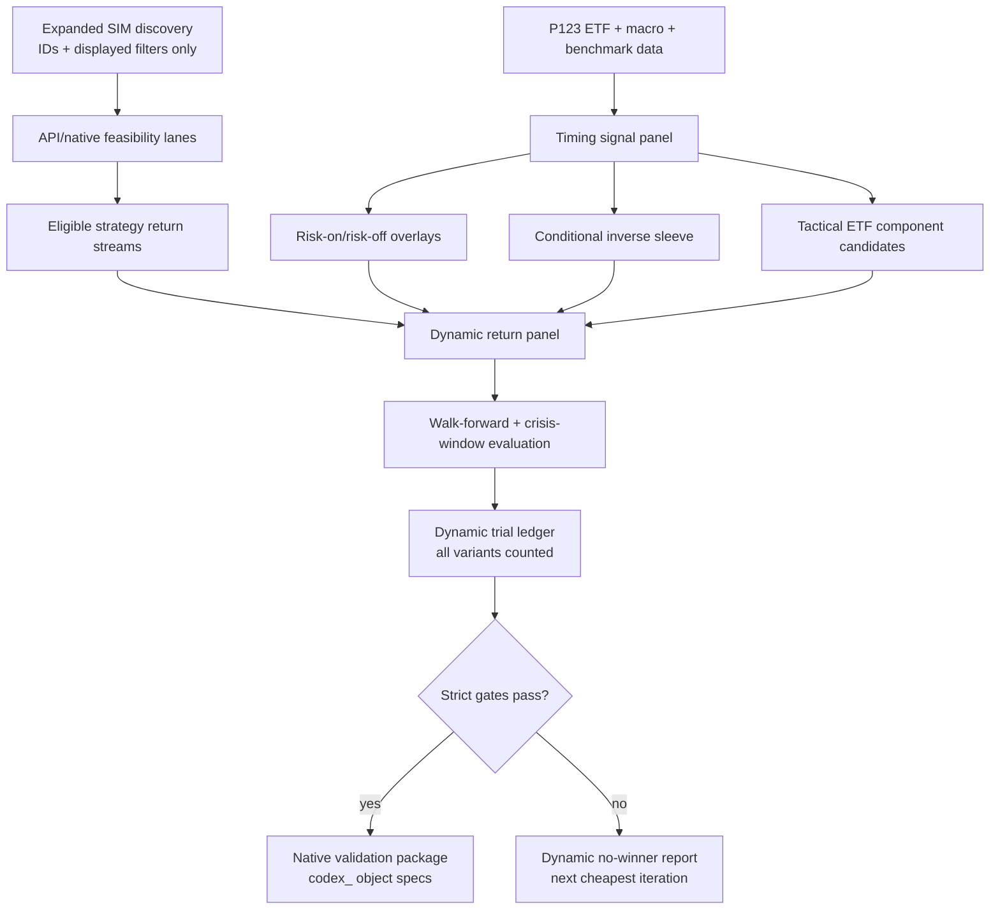

# Dynamic Portfolio123 Strategy Book Research Plan

## Summary

Build the next Portfolio123 Strategy Book research phase around dynamic exposure rather than more static weight tuning. The plan combines all seven ideation survivors: broader pre-2007 strategy discovery, P123-native timing rules, conditional inverse ETF exposure, a tactical ETF rotation component, macro stress gates, a disciplined API-estimated promotion funnel, and native Tier 1 validation only for candidates that survive the funnel.

---

## Problem Frame

The prior static allocation search tested 22,565 strict allocation rows and found no API-estimated candidate that met CAGR >20%, Sharpe >2.0, and max drawdown better than -25%. Drawdown-passing candidates topped out around 13-16% CAGR, which means the stricter goal likely requires either more low-correlated alpha streams, dynamic risk control, or both.

---

## Requirements

- R1. Use all seven survivor ideas from `docs/ideation/2026-05-22-dynamic-p123-strategy-book-ideation.md`.
- R2. Preserve the Portfolio123 validation hierarchy: API/local results can nominate candidates, but only native P123 Strategy Book simulation can prove the target was met.
- R3. Keep browser/SIM work discovery-only until known IDs are available; use the API for supported return, ETF, macro, and price data work.
- R4. Expand eligible simulated strategy discovery beyond the current SIM page slice while retaining displayed Sharpe >1 and inception date before 2007 as the initial filter.
- R5. Build P123-native timing candidates from a small, pre-registered set of technical and macro regime rules.
- R6. Replace always-on inverse ETF allocation with conditional inverse exposure that activates only during risk-off regimes.
- R7. Design a standalone `codex_` tactical ETF rotation component using pre-2007 ETF candidates, including inverse ETFs where valid.
- R8. Count every tested strategy source, timing rule, timing ensemble, ETF component variant, and allocation as part of `n_trials` for PSR/DSR discipline.
- R9. Use walk-forward, crisis-window, and strict target gates before promoting any candidate to native P123 object creation.
- R10. Maintain `iteration.md` and `p123-output/` artifacts so another user can reconstruct the logic, assumptions, trials, and results.
- R11. Stop and ask before creating/modifying native P123 objects or running credit-heavy operations beyond the approved budget.

---

## Scope Boundaries

- No live trades, live portfolio rebalances, transaction imports, object deletion, or live capital actions.
- No declaration that CAGR >20%, Sharpe >2.0, or max drawdown <25% was achieved unless native P123 Strategy Book simulation confirms it.
- No leveraged or leveraged-inverse ETFs in this plan.
- No post-2007 ETFs or strategies for the main back-to-2007 target.
- No broad random threshold search over timing rules.
- No external non-P123 data in final candidate rules; external references may inform hypotheses only.
- No secrets, cookies, API keys, passwords, or session values in code, docs, logs, screenshots, or chat.

### Deferred to Follow-Up Work

- Leveraged ETF or leveraged-inverse ETF exploration, if explicitly approved later.
- Relaxing the inception-date requirement, if the user chooses a shorter validation window later.
- Live Strategy Book management or trading workflows.
- Publishing or sharing results externally.

---

## Context & Research

### Relevant Code and Patterns

- `scripts/p123_strategy_book_research.py`: existing artifact-first pipeline with discovery, API feasibility, ETF validation, return panel construction, optimization, and reporting commands.
- `iteration.md`: required detailed research log and prior strict no-winner interpretation.
- `p123-output/return_panel_20260522.csv`: current synchronized API-derived panel from 2006-06-22 through 2026-01-05.
- `p123-output/strict_trial_ledger_20260522_strict_sh2_dd25.csv`: static strict search ledger with 22,565 counted trials and no winner.
- `p123-output/strict_no_winner_report_20260522_strict_sh2_dd25.md`: nearest-miss summary and cheapest-next-iteration rationale.
- `docs/solutions/workflow-issues/portfolio123-api-strategy-book-research-workflow-2026-05-22.md`: compounded workflow guidance for API-only Strategy Book research, trial ledgers, and no-winner reports.
- `docs/plans/2026-05-22-002-feat-api-only-p123-strategy-book-plan.md`: completed static/API-only predecessor plan.

### Institutional Learnings

- Browser/SIM values are acceptable for candidate discovery but not for final performance claims.
- A strategy without a clean API-derived or native-validatable return stream cannot safely enter a synchronized return panel.
- Missing pre-inception ETF returns must not be backfilled or treated as cash.
- Weighted-average CAGR and max drawdown are invalid; compute portfolio returns first, then metrics.
- A no-winner result is valid research when gates, trials, nearest misses, and next iteration are documented.

### External References

- P123 official technical documentation supports benchmark-series moving-average timing, including `SMA(50,0,#Bench) > SMA(200,0,#Bench)`.
- P123 strategy templates include an ETF momentum rotation pattern with `Ret1Y%Chg > 0` as an absolute momentum filter.
- P123 community material treats ETF rotation and market timing as native platform use cases, while warning about over-optimized timing systems.

---

## Key Technical Decisions

- **New plan, not an edit to the completed static plan:** The prior plan remains the audit trail for static allocation research. This plan owns dynamic exposure and expanded strategy discovery.
- **Four-lane research architecture:** The work proceeds through strategy discovery, timing overlays, conditional inverse/tactical ETF components, and final portfolio candidate promotion.
- **Small timing menu:** Timing rules are pre-registered archetypes, not an unbounded parameter hunt.
- **Conditional inverse exposure:** `SH`, `DOG`, and `PSQ` are treated as risk-off tools, not permanent portfolio ballast.
- **Tactical ETF component as a native-candidate strategy:** ETF rotation should be promoted as its own component if it survives API-estimated gates, making native P123 validation cleaner.
- **Macro stress gates are secondary:** Technical timing runs first because it is simpler and directly supported by price series. Macro rules enter only as a small add-on set after point-in-time behavior is confirmed.
- **Promotion funnel before native object creation:** Native `codex_` P123 strategy/book work begins only after API-estimated candidates pass strict gates.
- **Every variant is a trial:** Timing rules, signal ensembles, ETF component variants, discovery-source expansions, and allocation rows must all be reflected in the trial ledger or companion discovery ledger.

---

## Open Questions

### Resolved During Planning

- **Should all ideation survivors be used?** Yes. The user explicitly asked to use all survivors.
- **Should inverse ETFs remain in scope?** Yes, but conditionally timed rather than static.
- **Should the previous static plan be overwritten?** No. This is a separate active plan because it changes the research architecture.
- **Can browser discovery still be used?** Yes, for IDs and displayed filters only, with API/native validation afterward.

### Deferred to Implementation

- **Which additional SIM categories/pages expose more eligible strategy IDs?** Determine during discovery and log each source.
- **Which P123 API fields expose macro series most cleanly for timing tests?** Determine during the timing data build.
- **How closely API-estimated dynamic behavior matches native P123 strategy execution?** Determine only after a promoted candidate is created and validated natively.
- **Whether macro gates improve the frontier enough to justify inclusion:** Determine after the simple technical timing pass.

---

## Output Structure

    p123-output/
      dynamic_goal_strategy_book_YYYYMMDD.json
      expanded_strategy_discovery_YYYYMMDD.csv
      expanded_strategy_discovery_YYYYMMDD.json
      dynamic_strategy_feasibility_YYYYMMDD.csv
      timing_signal_panel_YYYYMMDD.csv
      timing_signal_summary_YYYYMMDD.json
      dynamic_return_panel_YYYYMMDD.csv
      tactical_etf_component_candidates_YYYYMMDD.csv
      dynamic_trial_ledger_YYYYMMDD.csv
      dynamic_trial_ledger_YYYYMMDD.json
      dynamic_candidate_promotion_report_YYYYMMDD.md
      dynamic_no_winner_report_YYYYMMDD.md
      native_validation_package_YYYYMMDD.md

---

## High-Level Technical Design

> *This illustrates the intended approach and is directional guidance for review, not implementation specification. The implementing agent should treat it as context, not code to reproduce.*

---

## Implementation Units

### U1. Dynamic Goal And Trial Accounting Scaffold

**Goal:** Create the dynamic research configuration and explicit `n_trials` accounting model before any new API calls or browser discovery.

**Requirements:** R1, R2, R8, R10

**Dependencies:** None

**Files:**
- Modify: `scripts/p123_strategy_book_research.py`
- Modify: `iteration.md`
- Create: `p123-output/dynamic_goal_strategy_book_YYYYMMDD.json`
- Create: `tests/test_p123_strategy_book_research.py`

**Approach:**
- Add a dynamic-goal configuration that records target thresholds, approved survivor ideas, allowed timing families, allowed inverse ETFs, excluded leveraged products, and promotion gates.
- Define how trials are counted for discovery sources, timing rules, timing ensembles, ETF component variants, and allocation rows.
- Keep prior static artifacts immutable and write dynamic artifacts with distinct names.

**Execution note:** Characterization-first. Confirm existing static commands still describe the prior run before extending the script.

**Patterns to follow:**
- Existing `GOAL` and dated artifact patterns in `scripts/p123_strategy_book_research.py`.
- Prior strict ledger naming in `p123-output/strict_trial_ledger_20260522_strict_sh2_dd25.csv`.

**Test scenarios:**
- Happy path: dynamic goal command writes valid JSON with all seven survivor ideas and strict thresholds present.
- Edge case: omitted timing family fails configuration validation.
- Error path: attempts to include leveraged ETFs fail validation.
- Integration: `iteration.md` records the dynamic phase start and links the new goal artifact.

**Verification:**
- Dynamic goal artifact is valid JSON, contains no secrets, and clearly separates dynamic research from the completed static run.

---

### U2. Expanded Pre-2007 Strategy Discovery

**Goal:** Discover more simulated strategies that meet displayed Sharpe >1 and inception before 2007, then classify their return-stream feasibility.

**Requirements:** R3, R4, R8, R10

**Dependencies:** U1

**Files:**
- Modify: `scripts/p123_strategy_book_research.py`
- Modify: `iteration.md`
- Create: `p123-output/expanded_strategy_discovery_YYYYMMDD.csv`
- Create: `p123-output/expanded_strategy_discovery_YYYYMMDD.json`
- Create: `p123-output/dynamic_strategy_feasibility_YYYYMMDD.csv`
- Test: `tests/test_p123_strategy_book_research.py`

**Approach:**
- Use browser/SIM pages only to gather IDs, names, displayed Sharpe, inception date, category/source, and inclusion reasons.
- Deduplicate against the five known eligible strategies from the static run.
- Push known IDs through the existing API feasibility pattern and preserve `tradable_stream`, `metadata_only`, and `api_failed` lanes.
- Add correlation and crisis-window previews only after clean return streams exist.

**Execution note:** Browser use remains discovery-only. If discovery would require expensive or account-mutating actions, stop and ask.

**Patterns to follow:**
- Existing `filter-discovery` and `strategy-feasibility` behavior.
- Project rule that the API lacks broad listing endpoints for several P123 object types.

**Test scenarios:**
- Happy path: multiple discovery sources merge into one deduplicated strategy table.
- Edge case: duplicate strategy IDs from different pages preserve all source labels.
- Error path: strategy API failure is recorded as `api_failed` without stopping the whole run.
- Integration: newly eligible strategies can be appended to the existing return panel only when clean daily returns exist.

**Verification:**
- Discovery artifacts show source, filters, inclusion lane, and no final performance claims from browser-table values.

---

### U3. P123-Native Timing Signal Panel

**Goal:** Build a timing signal panel from P123-supported price, benchmark, ETF, and macro data without look-ahead leakage.

**Requirements:** R5, R8, R9, R10

**Dependencies:** U1

**Files:**
- Modify: `scripts/p123_strategy_book_research.py`
- Create: `p123-output/timing_signal_panel_YYYYMMDD.csv`
- Create: `p123-output/timing_signal_summary_YYYYMMDD.json`
- Test: `tests/test_p123_strategy_book_research.py`

**Approach:**
- Pre-register a small technical signal set: benchmark above 200-day SMA, 50-day SMA above 200-day SMA, 12-month momentum positive, benchmark drawdown-from-high below threshold, and realized-volatility regime.
- Add macro stress candidates only after confirming P123 data availability and point-in-time-safe interpretation for rates, curve slope, inflation, and credit-spread proxies.
- Align timing signals to rebalance dates and apply lag/offset rules so same-day future information does not leak into allocation decisions.

**Execution note:** Timing formulas should be designed to translate into P123-native rules later, not just local Python signals.

**Patterns to follow:**
- P123 technical references for `SMA`, `Close`, `Ret%Chg`, `ATRN`, `Volatility`, and `HiValue`.
- P123 macro constants reference for `##FEDFUNDS`, `##UST10YR`, `##UST2YR`, `##CPI`, `##CORPBBBOAS`, and `##CORPBBOAS`.

**Test scenarios:**
- Happy path: timing panel aligns to the return panel dates and has no missing values after the declared warm-up period.
- Edge case: a signal requiring 252 bars starts only after enough history exists.
- Error path: unavailable macro series is excluded with a reason code, not silently filled.
- Integration: signal dates used for allocation are earlier than or equal to the returns they govern, with no look-ahead shift.

**Verification:**
- Timing summary lists every signal, formula intent, data source, warm-up window, and trial-count contribution.

---

### U4. Risk-On/Risk-Off Overlay Engine

**Goal:** Apply pre-registered timing overlays to existing and newly discovered strategy streams to create dynamic risky-component return variants.

**Requirements:** R5, R8, R9, R10

**Dependencies:** U2, U3

**Files:**
- Modify: `scripts/p123_strategy_book_research.py`
- Create: `p123-output/dynamic_return_panel_YYYYMMDD.csv`
- Test: `tests/test_p123_strategy_book_research.py`

**Approach:**
- Generate dynamic variants where risky strategy streams are fully invested during risk-on periods and moved to cash-like or defensive proxy behavior during risk-off periods.
- Include a small ensemble variant where multiple timing signals vote into exposure buckets such as full, reduced, defensive, or inverse-enabled.
- Preserve raw untimed strategy streams as baselines.
- Record each overlay variant and every exposure rule in the trial ledger.

**Execution note:** Do not choose timing thresholds after viewing final strict metrics. Use the pre-registered menu from U3.

**Patterns to follow:**
- Existing combined-return metric calculations in the optimizer.
- ML trading skill guidance on regime framing, walk-forward validation, PSR, DSR, and `n_trials`.

**Test scenarios:**
- Happy path: an untimed strategy and a timed variant share the same date index and differ only where the timing rule changes exposure.
- Edge case: consecutive whipsaw periods do not create duplicate or missing return rows.
- Error path: unavailable defensive proxy causes that variant to fail with a reason code.
- Integration: dynamic variants flow into portfolio metrics through the same combined return-series path as static components.

**Verification:**
- Dynamic panel preserves synchronized dates, labels every variant, and never uses weighted-average CAGR or drawdown.

---

### U5. Conditional Inverse Sleeve And Tactical ETF Component

**Goal:** Convert inverse ETFs from static ballast into conditional bear exposure and design a tactical ETF rotation component candidate.

**Requirements:** R6, R7, R8, R9, R10

**Dependencies:** U3, U4

**Files:**
- Modify: `scripts/p123_strategy_book_research.py`
- Create: `p123-output/tactical_etf_component_candidates_YYYYMMDD.csv`
- Test: `tests/test_p123_strategy_book_research.py`

**Approach:**
- Test inverse exposure only when risk-off signals fire, using pre-2007 inverse ETFs already validated through P123 data.
- Route non-inverse periods to either the best defensive ETF bucket or cash-like proxy, depending on the variant being tested.
- Build a tactical ETF component candidate from risk-on, defensive, and inverse buckets using simple momentum and volatility-aware ranking.
- Keep the ETF component sparse enough to translate into a native P123 ETF strategy if promoted.

**Execution note:** This unit should produce component candidates, not final book claims.

**Patterns to follow:**
- Existing ETF seed family metadata and API price validation.
- P123 ETF rotation template using absolute momentum.

**Test scenarios:**
- Happy path: inverse ETF returns appear only during declared risk-off periods in conditional variants.
- Edge case: if multiple inverse ETFs qualify, sleeve weights are capped and split according to the declared rule.
- Error path: a pre-2007 ETF with incomplete P123 history is excluded and logged.
- Integration: tactical ETF component candidates can be treated as components in the dynamic optimizer.

**Verification:**
- Candidate table shows ticker buckets, signal dependency, inverse usage, turnover proxy, and trial-count contribution.

---

### U6. Dynamic Optimizer, Walk-Forward Gates, And Promotion Funnel

**Goal:** Evaluate dynamic Strategy Book candidates with strict gates and promote only credible candidates toward native validation.

**Requirements:** R2, R8, R9, R10, R11

**Dependencies:** U2, U3, U4, U5

**Files:**
- Modify: `scripts/p123_strategy_book_research.py`
- Create: `p123-output/dynamic_trial_ledger_YYYYMMDD.csv`
- Create: `p123-output/dynamic_trial_ledger_YYYYMMDD.json`
- Create: `p123-output/dynamic_candidate_promotion_report_YYYYMMDD.md`
- Create: `p123-output/dynamic_no_winner_report_YYYYMMDD.md`
- Test: `tests/test_p123_strategy_book_research.py`

**Approach:**
- Run baselines first: original static winner, strict nearest misses, untimed expanded strategy set, and untimed tactical ETF component.
- Evaluate dynamic variants with CAGR >20%, Sharpe >2.0, max drawdown better than -25%, PSR, DSR, walk-forward consistency, and crisis-window behavior.
- Count all variants in `n_trials`, including timing rules and ETF component candidates.
- Produce either a promotion report or a no-winner report with nearest misses and exact gate failures.

**Execution note:** The optimizer should be narrower than the prior strict grid because dynamic variants already expand the hypothesis set.

**Patterns to follow:**
- Existing `optimize` and `report` commands.
- Existing strict no-winner report structure.

**Test scenarios:**
- Happy path: a candidate passing API-estimated gates is written to a promotion report with full lineage.
- Edge case: a candidate passes CAGR and Sharpe but fails crisis-window drawdown and is rejected.
- Error path: DSR failure blocks promotion even when headline metrics pass.
- Integration: every report row can be traced back to a dynamic trial ledger row.

**Verification:**
- Ledger and report agree on total trials, gates, pass/fail counts, and nearest misses.

---

### U7. Native Validation Package For Promoted Candidates

**Goal:** Prepare the exact native P123 validation package for any promoted candidate, without claiming final performance before native Strategy Book simulation.

**Requirements:** R2, R7, R9, R10, R11

**Dependencies:** U6

**Files:**
- Create: `p123-output/native_validation_package_YYYYMMDD.md`
- Modify: `iteration.md`

**Approach:**
- Translate promoted timing, ETF rotation, and allocation decisions into P123-native object specs using the `codex_` prefix.
- List each native object that would need to be created or modified, including strategy component, ETF component, Strategy Book, allocation weights, rebalance cadence, and rule formulas.
- Include a confirmation gate before any account object creation or credit-heavy native validation.
- Capture expected native validation screenshots/exports and DNA fingerprint fields.

**Execution note:** This unit prepares for native work. Actual native object creation begins only after explicit confirmation.

**Patterns to follow:**
- P123 Strategy Book validation workflow in the project instructions.
- `docs/solutions/workflow-issues/portfolio123-api-strategy-book-research-workflow-2026-05-22.md`.

**Test scenarios:**
- Happy path: promoted candidate package contains all formulas, component IDs, weights, gates, and object names needed for native validation.
- Edge case: no promoted candidate produces a no-winner handoff instead of an empty native package.
- Error path: missing formula or untranslated timing rule blocks native handoff.
- Integration: package references the exact trial ledger row that nominated the candidate.

**Verification:**
- Native package makes no final performance claim and clearly labels the next step as Tier 1 validation.

---

### U8. Iteration Log, Documentation, And Learning Capture

**Goal:** Keep the research trail understandable to another user and prepare a learning-capture handoff if new P123 platform behavior is discovered.

**Requirements:** R10, R11

**Dependencies:** U1 through U7

**Files:**
- Modify: `iteration.md`
- Modify: `docs/plans/2026-05-22-003-feat-dynamic-p123-strategy-book-plan.md`
- Create or modify if warranted: `docs/solutions/workflow-issues/*.md`

**Approach:**
- Update `iteration.md` after every meaningful research unit with logic, assumptions, trial counts, credit use, results, and rejected alternatives.
- Add plan amendments only when execution reveals a planning-level change, not for ordinary progress.
- Recommend `ce-compound` when a durable Portfolio123 API, browser, formula, or native-validation lesson emerges.

**Execution note:** Documentation is part of the deliverable, not an end-of-run cleanup chore.

**Patterns to follow:**
- Existing detailed entries in `iteration.md`.
- Existing `docs/solutions/workflow-issues/portfolio123-*.md` structure.

**Test scenarios:**
- Happy path: every generated report has a corresponding iteration-log entry explaining why it exists.
- Edge case: a no-winner outcome is documented with nearest misses and next iteration, not treated as a failure.
- Error path: an API or browser limitation is recorded with enough detail to reproduce.
- Integration: final handoff points to the plan, ledger, reports, and any native validation package.

**Verification:**
- Another user can read the plan plus `iteration.md` and understand the research logic without relying on chat history.

---

## System-Wide Impact

- **Research pipeline:** Extends the existing artifact-first API pipeline instead of replacing it.
- **P123 account state:** No account object is created until a promoted candidate passes API-estimated gates and the user confirms native validation.
- **Statistical validity:** The dynamic phase increases hypothesis count, so `n_trials`, DSR, walk-forward, and crisis-window reporting become more important than in the static phase.
- **Documentation:** `iteration.md` remains the human-readable audit trail; `p123-output/` remains the machine-readable artifact store.
- **Validation hierarchy:** Native P123 Strategy Book simulation remains the only source for final target achievement.

---

## Risks & Mitigations

| Risk | Mitigation |
|------|------------|
| Timing overfit | Pre-register a small timing menu, count every variant, require walk-forward and DSR gates. |
| Inverse ETF whipsaw | Evaluate crisis windows and choppy periods separately; reject variants that improve 2008 but degrade full-period Sharpe or CAGR. |
| API/native mismatch | Treat API-estimated dynamic results as nomination only; require native P123 component and Strategy Book validation before final claims. |
| Discovery bias from SIM page ordering | Record every discovery source and exclusion reason; deduplicate IDs and preserve source labels. |
| Macro data lag or revision risk | Confirm P123 series behavior before using macro gates; keep macro gates secondary until validated. |
| Credit waste | Reuse existing return panel first, estimate credits before new calls, and ask before crossing approved budgets. |
| Research trail becomes hard to follow | Update `iteration.md` at each unit and keep reports derived from ledgers. |

---

## Success Metrics

- More than five eligible pre-2007 strategy streams are evaluated if discovery finds clean return data.
- Timing and conditional inverse variants are compared against untimed baselines, not judged in isolation.
- Every dynamic candidate has a traceable `n_trials` lineage.
- At least one API-estimated candidate is either promoted to native validation or a no-winner report explains exactly why none were promoted.
- No final target claim is made without native P123 Strategy Book validation.

---

## Verification Plan

- Run unit-level artifact tests for config, discovery merging, timing signal alignment, dynamic return panel construction, and ledger/report consistency.
- Run CLI smoke checks for the new dynamic commands before any credit-heavy API work.
- Validate all generated Markdown has required creation metadata where applicable.
- Inspect generated CSV/JSON artifacts for secret-free contents.
- Confirm `iteration.md` captures the dynamic phase start, each major run, and final handoff state.

---

## Handoff Options

Recommended next step: run `ce-work` on this plan and start with U1 through U3 before spending new broad API credits.

